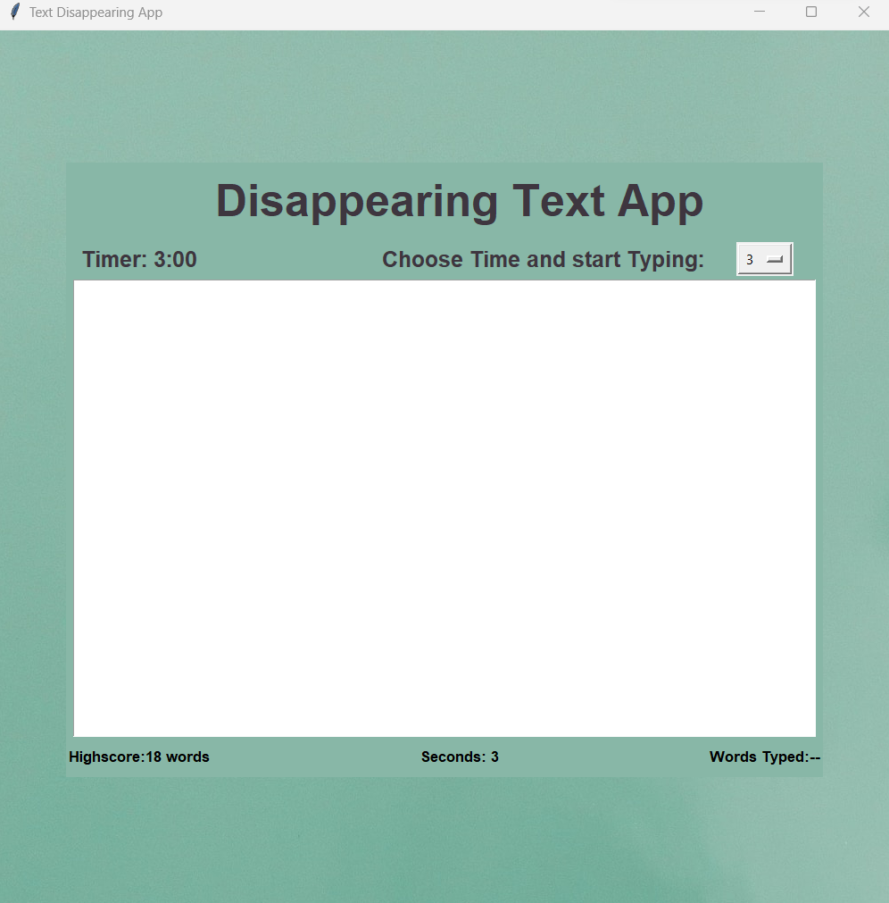
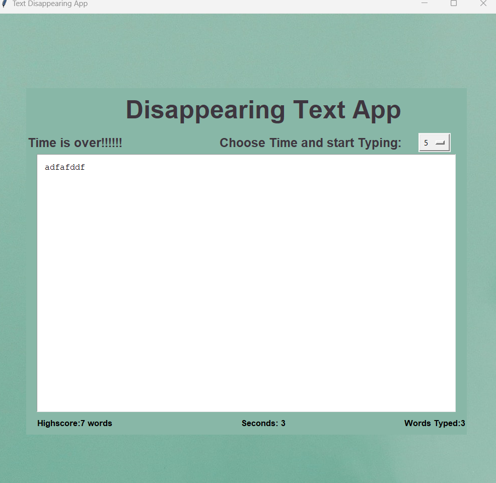
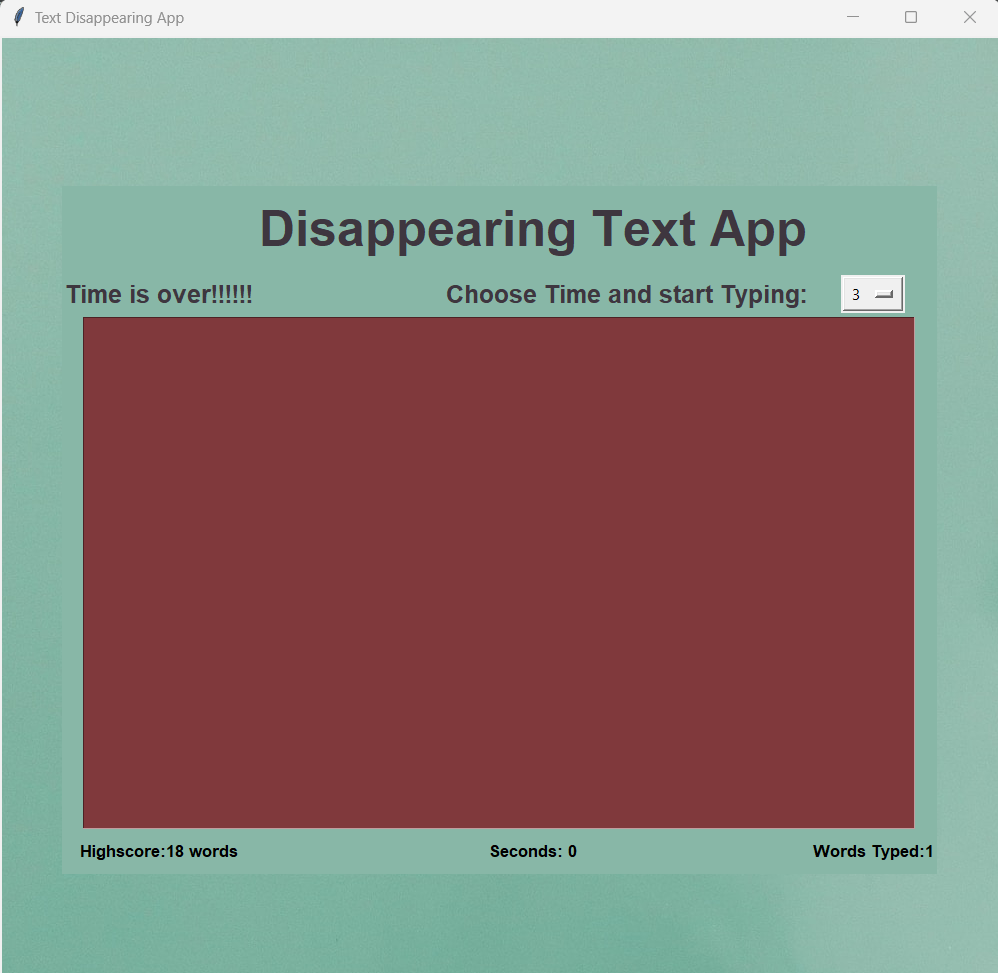
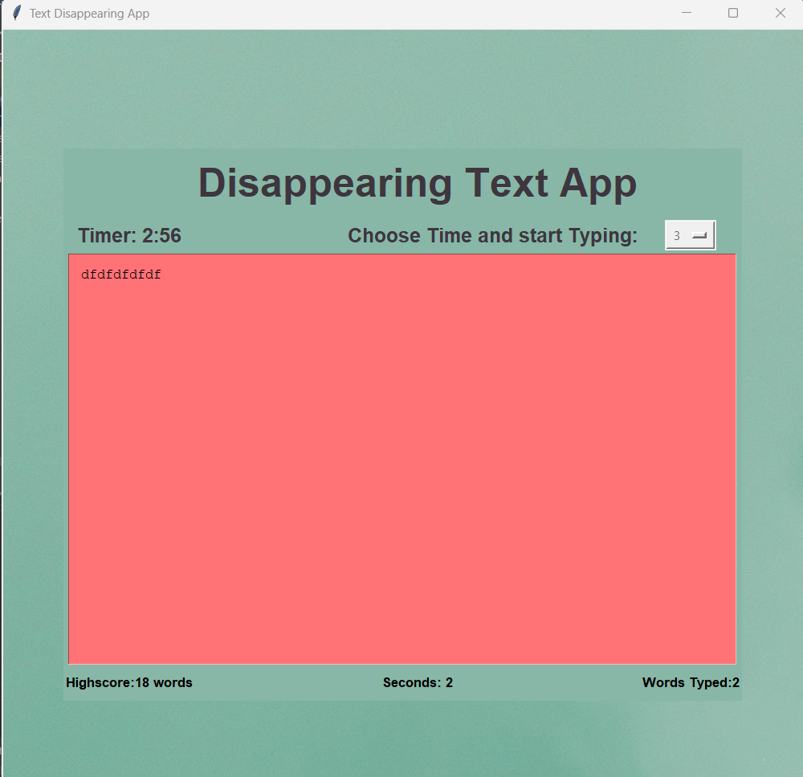

# Disappearing Text App 📝

## Description 🚀

The Disappearing App is a Python application with a graphical user interface (GUI) built using the Tkinter module. It is designed to help content writers maintain their productivity by setting a timer (3️⃣ or 5️⃣ minutes) and motivating them to keep writing. The app keeps track of the user's keyboard input and saves the highest word count achieved during the specified time duration.

## Features ✨

- Choose between a 3️⃣-minute or 5️⃣-minute timer.
- Displays the highest word count achieved during the selected time duration.
- Autosave functionality to save the written content in a text file.
- Automatic content deletion if no typing is detected within 3️⃣ seconds to encourage continuous writing.

## Requirements 📋

- Python 3.x
- Tkinter (usually included with Python)

## Usage 📖

- Run the `main.py` script on your IDE.

- Select the desired time duration (3️⃣ minutes or 5️⃣ minutes) and start writing.

- If you stop typing for 3️⃣ seconds, the app will automatically delete your content.

- Your highest word count is displayed, and the written content is saved to a text file.

## Working of App 🖥️

### 3️⃣ mins interface:

### 5️⃣ mins interface:

### Time Over ⏰:

### 3️⃣ sec timer ⏲️:

